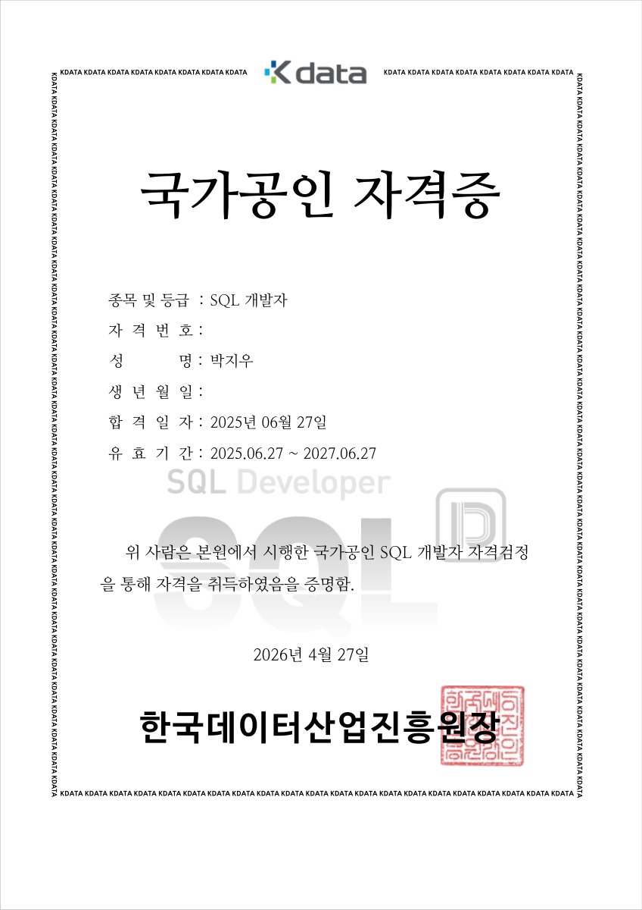
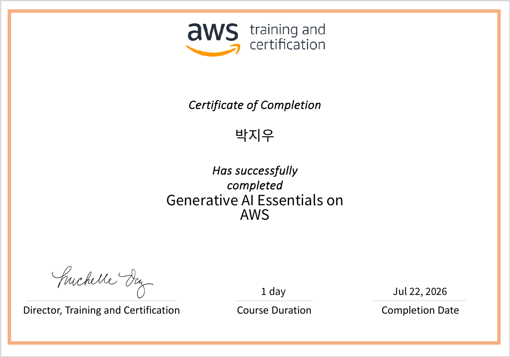
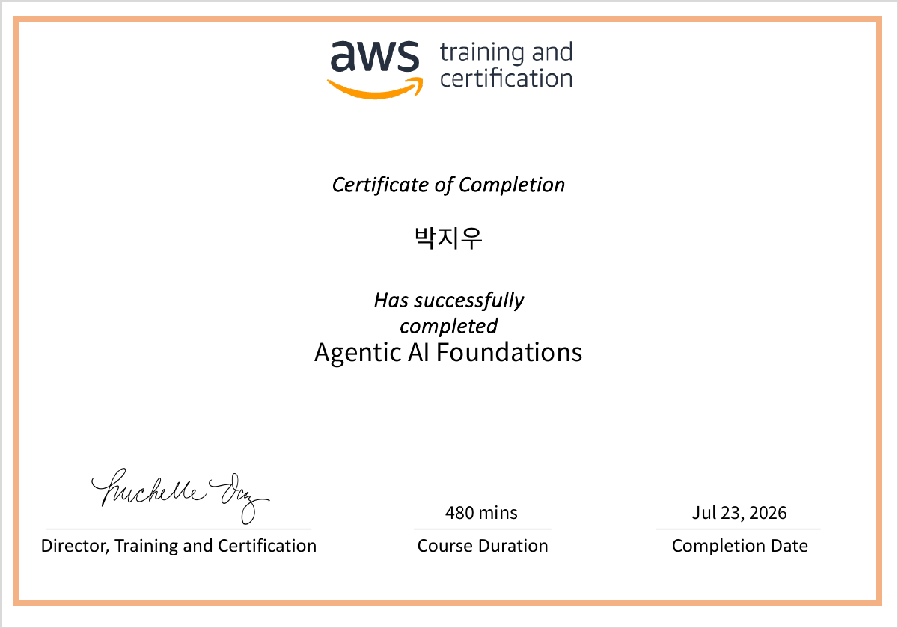

---

## 👋 About Me

**Computer Vision**과 **AI**를 연구하는 엔지니어입니다. 현재 **[AIV Lab](https://aivlab.pages.dev/)** 에서 **3D Pose Estimation**과 **Computer Vision** 연구를 수행하고 있으며, 영상 속 움직임과 상태를 **정량적인 데이터로 변환하여 분석**하는 문제에 관심을 가지고 있습니다.

특히 단순히 객체를 탐지하거나 자세를 추정하는 것을 넘어, 영상으로부터 **의미 있는 정보를 추출**하고 이를 실제 **의사결정에 활용할 수 있는 형태로 해석**하는 연구를 지향하고 있습니다.

이를 위해 **단일 카메라 기반 3D Human Pose Estimation**, 동작 분석, 객체 탐지 등 다양한 Computer Vision 문제를 다루고 있으며, **축구 드리블 동작 자동 평가 시스템**과 **YOLO 기반 객체 탐지 파이프라인** 구축 프로젝트를 수행한 경험이 있습니다.

또한 **Redis**와 **Kafka**를 활용한 대규모 티켓팅 시스템을 설계하고 개발하여 실제 **6,000명 이상의 사용자**가 이용한 서비스를 운영했습니다. AI 연구뿐 아니라 **실제 서비스 환경에서 안정적으로 동작하는 시스템**을 설계하고 구현하는 역량도 함께 갖추고 있습니다.

궁극적으로는 영상으로부터 얻은 정보를 **실제 가치 있는 의사결정으로 연결하는 AI 엔지니어**를 목표로 하며, Computer Vision 연구와 서비스 개발을 아우르는 문제 해결에 지속적으로 도전하고 있습니다.

<table>
<tr>
<td valign="top" width="50%">

### 🎓 Education
- **단국대학교 (Dankook University)**
- 소프트웨어학과 학사 과정
- 2021.03 ~ 현재

</td>
<td valign="top" width="50%">

### 🔬 Research
- **[AIV Lab](https://aivlab.pages.dev/)** — 학부 연구생
- Advisor: **[Boeun Kim](https://aivlab.pages.dev/faculty)**
- 2025.09 ~ 현재
- Area: **Computer Vision, AI, 3D Pose Estimation**

</td>
</tr>
</table>

---

## 🏆 Achievements

### 🏆 Awards

> **🥇 Conquer Health 해커톤 벤치마크 상 (루닛 주최)** 의료 AI 챗봇 추론 최적화로 HealthBench 평가 최고점 달성
>
> Lunit L2-preview 기반 의료 대화 시스템을 개발하고, 모델 가중치 변경 없이 추론 파이프라인을 최적화했습니다.
>
> **주요 구현** • 질문의 각 요구에 답하도록 답변 커버리지와 멀티턴 문맥 보강 • 공식 데이터가 필요한 질문에 선택적 MCP 조회 적용 • 시간과 토큰 예산을 관리하고 출력을 검증해 답변 누락과 잘림을 줄이는 처리 구현
>
[프로젝트](https://github.com/Hackathon-AIM/health-conquer-submission) &nbsp; | &nbsp; [성능 개선 기록](https://github.com/Hackathon-AIM/health-conquer-submission/blob/main/docs/performance.md) &nbsp; | &nbsp; [상장 PDF](assets/credentials/conquer-health-benchmark-award.pdf) &nbsp; | &nbsp; [수상 기사](https://www.aitimes.kr/news/articleView.html?idxno=41599)

### 📜 Certifications

> **SQLD (SQL 개발자)** 한국데이터산업진흥원 2025.06.27 취득 [자격증 확인](assets/credentials/sqld-public.pdf)

### 🎓 Programs & Training

> **Generative AI Essentials on AWS — 수료** AWS Training and Certification 2026.07.22 (1일 과정) [수료증 PDF](assets/credentials/aws-generative-ai-essentials.pdf)

> **Agentic AI Foundations — 수료** AWS Training and Certification 2026.07.23 (480분 과정) [수료증 PDF](assets/credentials/aws-agentic-ai-foundations.pdf)

<strong>📎 수상, 자격, 교육 증빙 모아보기</strong>

수상, 자격, 교육 이력은 첨부 증빙을 기준으로 작성했습니다. AWS 두 과정은 교육 수료입니다. SQLD 공개 사본에서는 생년월일, 자격번호, 사진, 하단 검증 코드를 가렸습니다.

**Conquer Health — 벤치마크 상**

**SQLD — 국가공인 SQL 개발자**

**AWS — Generative AI Essentials on AWS**

**AWS — Agentic AI Foundations**

---

## 📂 Main Projects

| 프로젝트 | 기간 | 설명 | 기술 | 성과 / 링크 |
|---|---|---|---|---|
| **비정형 영상 기반 로봇 학습 데이터 구축 파이프라인** | **2026.07 – 2026.11** |   비정형 스포츠 및 공연 영상을 분석해 행동 구간과 인물별 3D 모션을 추출하고 동작 설명을 연결 로봇 학습에 활용할 사람 동작 데이터 구축 연구 | Python, PyTorch, OpenCV, FFmpeg, CoMotion, Multi-HMR 2, MotionGPT | 원본 입력과 크롭 입력의 메시 복원 비교 및 모션 캡셔닝 실험 모델별 환경 구축 및 추론 스크립트 정리 [GitHub](https://github.com/DKU-AIM/video-motion-pipeline) |
| **Dan Zzan (단짠)** | 2025.12 – 2026.05 | 총학생회와 협업하여 **실제 축제에서 운영**한 티켓팅, 공연, 부스, 공지 통합 서비스   **Redis + Lua Script 선착순 티켓팅**, **JWT 학번 인증** 개발    | Spring Boot, Redis, Kafka, MySQL, React, TypeScript, NHN Cloud | **실 운영**: 동시접속 4,500명, 3,500장 1분 매진, 중복발급 ZERO   **부하 테스트**: k6 10,000VU 통과   [GitHub](https://github.com/DKU-Dan-Zzan) |
| **넙치 질병 조기 탐지 시스템** | 2026.03 – 2026.06 | **YOLO26 Fine-tuning** 기반 3-Stage 파이프라인 (탐지→분류→병변)   7종 질병 증상 자동 분류 + 위험도 알림 시스템   AIHub 넙치 질병 데이터 **48,000장** 학습 | Python, YOLO26, PyTorch, OpenCV, Flutter, FastAPI | Det mAP50: 0.445, Cls Acc: 83.99%   7클래스 증상 분류 + 질병 대응 가이드 자동 생성   [GitHub](https://github.com/jiwoo1105/fish-disease-detection) |
| **축구 드리블 동작 분석** | 2025.11 – 2026.06 | **단안 카메라 영상** 기반 축구 드리블 자세 정량 평가 시스템   **공 터치 자동 감지** 및 어깨/골반 회전각, 헤드업 각도 분석 | Python, Mediapipe, SAM2, YOLOv8, OpenCV | 단일 카메라 영상만으로 드리블 자세 정량 평가 자동화   [GitHub](https://github.com/jiwoo1105/soccer_motion_analysis) |
| **MedGuard** | 2026.02 – 2026.06 | **의료영상 적대적 공격 분석 및 방어** 시스템   FFT 주파수 분석으로 공격 유형(FGSM/PGD/DiffAttack) 자동 분류   **RoentGen VAE 기반 Medical DiffPure** 의료 특화 정화 파이프라인 | Python, PyTorch, Stable Diffusion, Gradio, TorchXRayVision | Robust Acc: FGSM 58.31%, PGD 61.47%, DiffAttack **78.56%**   전 공격 유형 최고 방어율 달성   [GitHub](https://github.com/jiwoo1105/AISecurity) |

## 🛠 Skills
### AI / Vision

### Development & Tools

### Collaboration

---

[GitHub 활동](https://github.com/jiwoo1105?tab=overview) &nbsp; | &nbsp; [전체 저장소](https://github.com/jiwoo1105?tab=repositories)

